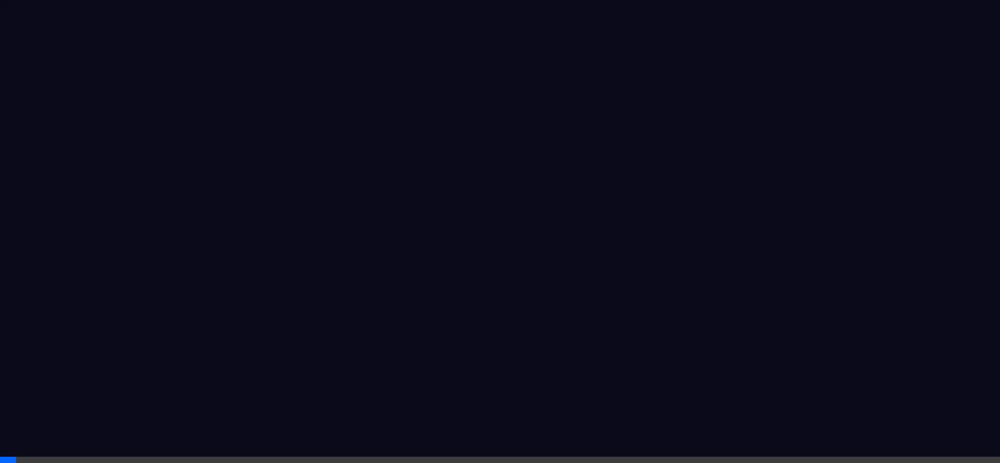
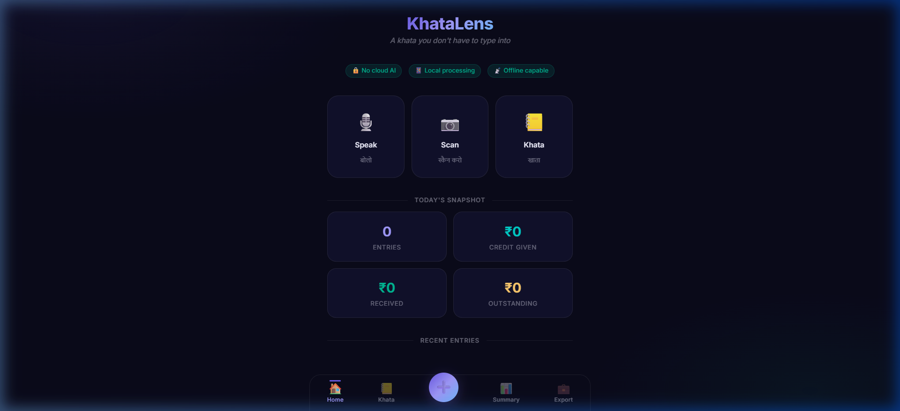
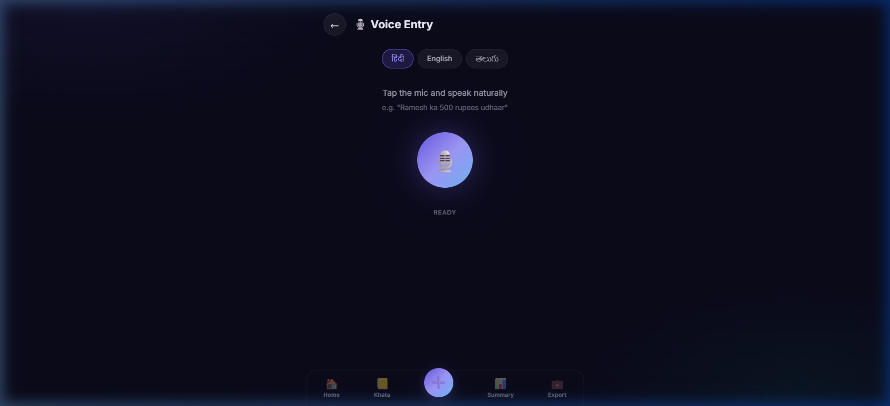
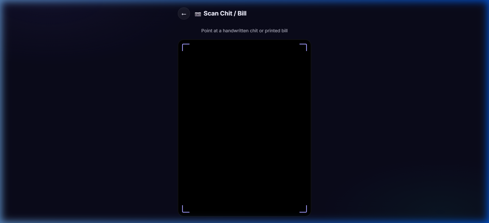
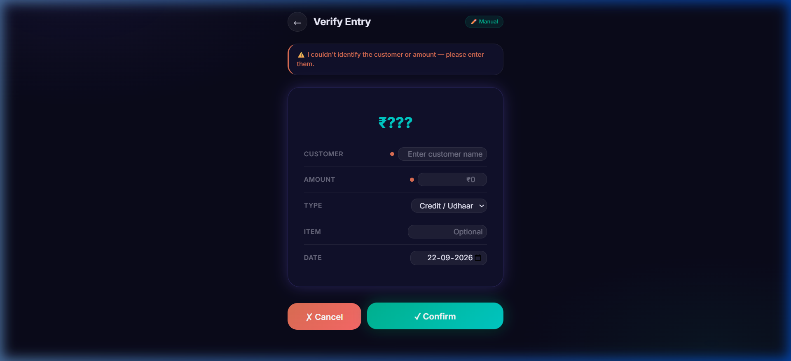
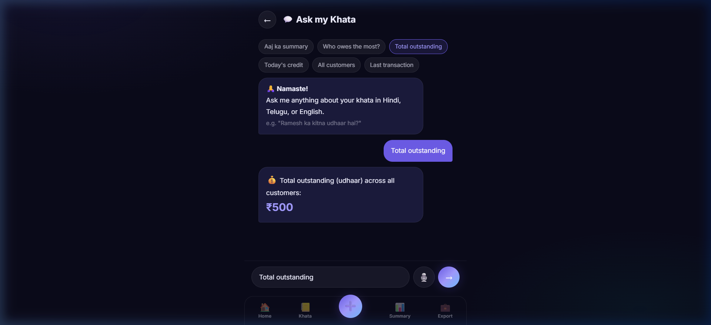
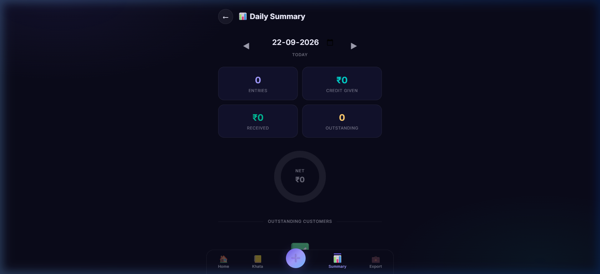
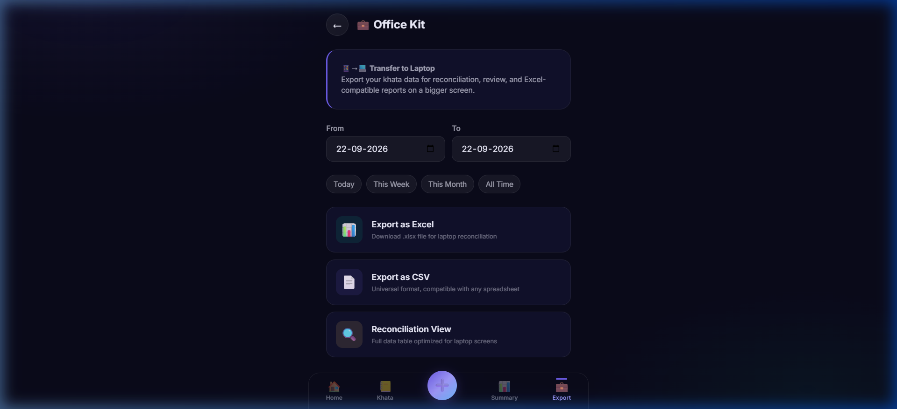

# 📖 KhataLens — खाता लेंस

> ### *"A khata you don't have to type into."*
> **Point. Speak. Confirm. Done.**
>
> An offline-first, phone-first AI financial ledger engineered for India's 60+ million micro-businesses. Capture transactions via handwritten chits or natural speech in Hindi, Telugu, and English — with zero cloud dependency and 100% on-device privacy.

---

[](https://developer.mozilla.org/en-US/docs/Web/Progressive_web_apps)
[](https://dexie.org)
[](https://vitejs.dev/)
[](#-multi-language-voice-engine)
[](https://github.com/faraaz-748-019/IQOO)
[](https://www.netlify.com)

---

## 🌐 Live Demo & Repository

- **GitHub Repository**: [https://github.com/faraaz-748-019/IQOO](https://github.com/faraaz-748-019/IQOO)
- **Live Demo Link**: Deployable via Netlify directly from this repository (see [Deployment Guide](#-deployment-guide))
- **Walkthrough Video**: [KhataLens_Live_Demo.webp](KhataLens_Live_Demo.webp) · [Open Interactive Player (walkthrough.html)](walkthrough.html)

---

## 🎥 Walkthrough Video Demonstration

> **Short & Crisp Live Product Demonstration (Point. Speak. Confirm. Done.)**  
> Showcases all core workflows: Home Dashboard ➔ Multi-Language Voice Capture ➔ Chit OCR Viewfinder ➔ Local Offline Ledger ➔ "Ask my Khata" Natural Language Query ➔ Daily Summary ➔ Office Kit Laptop Handoff & Excel Export.



---

## 📑 Table of Contents

- [The Problem](#-the-problem)
- [The KhataLens Solution](#-the-khatalens-solution)
- [Core Philosophy: The Trust Layer](#-core-philosophy-the-trust-layer)
- [System Architecture](#-system-architecture)
- [Key Features & Workflows](#-key-features--workflows)
- [Visual Showcase](#-visual-showcase)
- [Technology Stack](#-technology-stack)
- [Getting Started Locally](#-getting-started-locally)
- [Deployment Guide](#-deployment-guide)
- [Project Structure](#-project-structure)
- [Hackathon Rubric Alignment](#-hackathon-rubric-alignment)
- [Author & Acknowledgments](#-author--acknowledgments)

---

## 💡 The Problem

India has over **63 million micro-businesses** — kirana stores, vegetable vendors, tea stalls, and small trade workshops. Most of them still track credit (*udhaar* / *baaki*) on paper chits, wooden boards, or physical khata notebooks.

### Why do existing digital ledger apps struggle?
1. **High Data-Entry Friction:** Typing customer names, items, and figures on small digital keyboards during peak rush hours is tedious and slows down business.
2. **Connectivity Dependency:** Cloud-based apps fail in basements, rural areas, or spotty mobile network zones.
3. **Data Privacy Concerns:** Small merchants are wary of uploading their daily transaction records and customer phone books to proprietary cloud servers.
4. **Language Barriers:** Existing solutions require reading through deep hierarchical menus in unfamiliar interfaces.

---

## ⚡ The KhataLens Solution

**The innovation of KhataLens isn't digitizing the khata; it is removing the data-entry step entirely.**

```
                     ┌──────────────────────┐
                     │      SHOP OWNER       │
                     └──────────┬───────────┘
                                │
                 ┌──────────────┴──────────────┐
                 │                             │
             📷 CAMERA                      🎙️ VOICE
      (Handwritten Chits / Bills)      (Hindi / Telugu / English)
                 │                             │
                 ▼                             ▼
          On-Device OCR                  On-Device ASR
          (Tesseract.js)               (Web Speech API)
                 │                             │
                 └──────────────┬──────────────┘
                                ▼
                     ┌─────────────────────┐
                     │   LOCAL AI ENGINE   │
                     │  Entity Extraction  │
                     │   Intent Detection  │
                     │  Amount Validation  │
                     └──────────┬──────────┘
                                ▼
                     ┌─────────────────────┐
                     │  SMART CONFIRMATION │
                     │  Ramesh · ₹500 · 🔴 │
                     │   [✓] Confirm [✎]   │
                     └──────────┬──────────┘
                                ▼
                     ┌─────────────────────┐
                     │   LOCAL LEDGER DB   │
                     │ (Dexie / IndexedDB) │
                     └──────────┬──────────┘
                        │                │
               "Ask my Khata"        Office Kit
              (Natural Queries)          │
                        │                ▼
                        │      ┌─────────────────────┐
                        │      │   LAPTOP / DESKTOP  │
                        └─────▶│   Reconciliation    │
                               │  Excel / CSV Export │
                               │  Daily Summary View │
                               └─────────────────────┘
```

1. **Point** your phone camera at a handwritten receipt, slip, or printed bill.
2. **Or Speak** naturally in Hinglish, Telugu, or English (*"Ramesh ko 500 ka tel diya udhaar"*).
3. **Smart Confirmation** reviews the parsed amount, customer, and transaction type in less than a second.
4. **Done!** The ledger is instantly updated offline on the device.

---

## 🛡️ Core Philosophy: The Trust Layer

> **KhataLens never silently commits an AI interpretation as financial fact.**

In financial software, hallucinated transactions destroy trust. Every camera or voice capture is processed through our **Fast-Trust Verification Screen**:
- **Confidence Rating**: Clear color-coded confidence indicators (High / Medium / Low).
- **Graceful Clarification**:
  - **High Confidence**: Pre-fills customer, amount, item, and transaction type for instant 1-tap confirmation.
  - **Ambiguous Speech/Text**: Highlights the uncertain field with suggested corrections.
  - **Missing Details**: Prompts explicitly (*"Could not identify the amount — please tap to enter"*).
- **Haptic & Audio Feedback**: Positive confirmation chimes reinforce successful entry.

---

## 🚀 Key Features & Workflows

### 1. 🎙️ Multi-Language Voice Engine
- Natural-language speech recognition supporting **Hindi**, **Telugu**, and **English**.
- Smart bilingual entity extraction maps colloquial terms into structured schemas:
  - *"udhaar"*, *"baaki"*, *"credit"*, *"diya"* ➔ **Credit Given (Debit)**
  - *"jama"*, *"aaya"*, *"mila"*, *"received"* ➔ **Payment Received (Credit)**
  - Numerals, spoken currency words, and item identification (*"500 rupaye"*, *"do sau"*, *"tel"*).

### 2. 📷 On-Device Camera & Chit Scanner
- Local optical character recognition (OCR) via web-assembly Tesseract engine.
- Extracts merchant chits, hand-scribed paper slips, and printed bills directly from the camera or gallery.
- Zero server hops — images are processed locally on the client device.

### 3. 💾 100% Offline Local Ledger
- Powered by client-side IndexedDB with reactive queries via **Dexie.js**.
- Works seamlessly on airplanes, rural areas, or during network blackouts.
- Search, filter by credit / payment, and sort by date or customer instantly.

### 4. 💬 "Ask my Khata" (Natural Language Local Query)
- Shopkeepers don't need to manually filter through hundreds of records.
- Conversational querying directly against the local ledger:
  - *"Ramesh ka kitna udhaar hai?"* (What is Ramesh's balance?)
  - *"Aaj kitna credit diya?"* (How much credit was given today?)
  - *"Who owes me the most?"* (Ranks top outstanding debtors)
  - *"Total balance"* (Quick cashflow summary)
- Suggestion chips provide 1-tap questions for quick access.

### 5. 📊 Real-Time Daily Summary & Cashflow
- Daily executive dashboard displaying:
  - **Total Sales & Collections**
  - **Total Credit Extended (Udhaar)**
  - **Net Receivable Balance**
  - **Top Outstanding Debtors** list with instant settlement actions
- Interactive visual distribution chart.

### 6. 💼 Office Kit (Phone → Laptop Handoff)
- Designed specifically for end-of-day shop closing and reconciliation:
  - Phone captures high-speed inputs throughout the day.
  - Laptop / tablet connects to the same ledger for desktop-grade reconciliation.
  - 1-click **Excel (.xlsx)** and **CSV** export compatible with standard accounting software (Tally, Zoho, Excel, Vyapar).
  - Date-range filtering and audit logs.

### 7. 📱 Progressive Web App (PWA)
- Installable directly to home screen on Android and desktop Chrome.
- Fast cache-first Service Worker architecture.
- AMOLED-friendly dark UI theme with low power consumption and glassmorphic finish.

---

## 📸 Visual Showcase

| Screen | Description | Preview |
|---|---|---|
| **Home Dashboard** | Quick balance metrics, action triggers, and recent entries |  |
| **Voice Capture** | Hindi / Telugu / English natural voice recognition |  |
| **Camera OCR** | On-device scanner for paper chits and receipts |  |
| **Smart Confirmation** | Trust layer with confidence score and structured edit fields |  |
| **Ask my Khata** | Natural language queries on your offline ledger |  |
| **Daily Summary** | Sales, collections, and debtor rankings |  |
| **Office Kit** | Desktop reconciliation & Excel export |  |

---

## 🛠️ Technology Stack

| Layer | Technology | Rationale |
|---|---|---|
| **Framework & Build** | **Vite 6** + Modern Vanilla JavaScript (ESM) | Ultra-fast build, zero heavy runtime bloat, instantaneous loading |
| **Styling** | Custom Vanilla CSS Design System | Responsive layout, AMOLED dark theme (`#080811`), glassmorphism, micro-animations |
| **Local Database** | **Dexie.js** (IndexedDB) | Reactive, schema-versioned local storage, completely private & offline |
| **Vision AI (OCR)** | **Tesseract.js** (WASM) | Client-side optical character recognition running directly in the browser thread |
| **Speech AI (ASR)** | **Web Speech API** | Built-in hardware-accelerated speech-to-text with multi-language support |
| **Entity Extraction** | Custom Rule & Pattern Local AI Parser | Sub-10ms latency deterministic entity extraction without cloud LLM costs |
| **Spreadsheet Engine** | **SheetJS (xlsx)** | Native client-side generation of Excel workbooks for Office Kit exports |
| **PWA Engine** | Service Worker + Web App Manifest | Cache-first offline execution, standalone full-screen mobile app experience |

---

## 💻 Getting Started Locally

### Prerequisites
- [Node.js](https://nodejs.org/) (version 18 or higher recommended)
- `npm` (comes bundled with Node.js)

### Installation & Run

1. **Clone the repository:**
   ```bash
   git clone https://github.com/faraaz-748-019/IQOO.git
   cd IQOO
   ```

2. **Install dependencies:**
   ```bash
   npm install
   ```

3. **Start the development server:**
   ```bash
   npm run dev
   ```
   Open your browser at `http://localhost:3000/`.

4. **Build for production:**
   ```bash
   npm run build
   ```
   The production assets will be output to the `dist/` directory.

5. **Preview production build locally:**
   ```bash
   npm run preview
   ```

---

## ☁️ Deployment Guide

### Deploying to Netlify (Recommended)

1. **Push your code to GitHub** (already configured with repository `faraaz-748-019/IQOO`).
2. Log in to [Netlify](https://www.netlify.com/).
3. Click **"Add new site"** ➔ **"Import an existing project"**.
4. Select **GitHub** and choose `faraaz-748-019/IQOO`.
5. Netlify will automatically detect the settings from `netlify.toml`:
   - **Build Command:** `npm run build`
   - **Publish Directory:** `dist`
6. Click **"Deploy Site"**. In less than a minute, your live HTTPS demo link will be generated!

> 💡 *Note: Running over HTTPS on Netlify ensures that browser permissions for Microphone (Voice Input) and Camera (OCR Scanner) work automatically without security restrictions.*

---

## 📂 Project Structure

```
IQOO/
├── .gitignore               # Git ignore patterns (node_modules, dist, etc.)
├── index.html               # Main HTML entry point & viewport meta
├── netlify.toml             # Netlify deployment & SPA routing configuration
├── package.json             # Project dependencies & build scripts
├── vite.config.js           # Vite server & build configuration
├── docs/
│   └── screenshots/         # Verified UI screenshots for documentation
│       ├── camera.png
│       ├── confirm.png
│       ├── home.png
│       ├── office_kit.png
│       ├── query.png
│       ├── summary.png
│       └── voice.png
├── public/
│   ├── manifest.json        # PWA Web App Manifest
│   ├── sw.js                # Service Worker for offline caching
│   └── icons/               # App icons & SVGs
│       ├── favicon.svg
│       ├── icon-192.png
│       └── icon-512.png
└── src/
    ├── app.js               # Main SPA router, navigation & state controller
    ├── ai/
    │   ├── entity-extractor.js  # Intent & entity extraction engine
    │   └── query-engine.js      # Natural language local query processor
    ├── capture/
    │   ├── camera.js            # Video stream & camera capture utilities
    │   ├── ocr-engine.js        # On-device Tesseract OCR pipeline
    │   └── voice-engine.js       # Multi-language speech recognition engine
    ├── db/
    │   └── database.js          # Dexie.js IndexedDB schema & CRUD operations
    ├── screens/
    │   ├── capture-camera.js    # Camera & file upload screen
    │   ├── capture-voice.js     # Voice recording & transcription screen
    │   ├── confirmation.js      # Trust layer confirmation & edit modal
    │   ├── home.js              # Main dashboard with quick action triggers
    │   ├── ledger.js            # Searchable, filterable transaction list
    │   ├── office-kit.js        # Laptop reconciliation & Excel/CSV export
    │   ├── query.js             # "Ask my Khata" conversational query screen
    │   └── summary.js           # Daily statistics & debtor analysis
    ├── styles/
    │   └── index.css            # Complete design system & token definitions
    └── utils/
        ├── audio-feedback.js    # Haptic / audio chime feedback generator
        ├── currency.js          # Indian numbering format (₹ / Lakhs)
        └── date.js              # Date formatting & grouping utilities
```

---

## 🏆 Hackathon Rubric Alignment

| Rubric Criteria | Weight | How KhataLens Excels |
|---|:---:|---|
| **End Product Quality** | **30%** | Full end-to-end lifecycle built: Voice/Camera ➔ Parse ➔ Smart Confirm ➔ Offline Ledger ➔ Natural Language Query ➔ Excel Export. Not a mock or prototype. |
| **Novelty & Impact** | **20%** | Rather than merely digitizing paper ledgers, it **eliminates manual data-entry completely**, solving the single biggest barrier for 60M+ Indian merchants. |
| **Creative Phone Use** | **15%** | Native hardware utilization: high-res camera for chit OCR, microphone for multi-language speech, local storage, haptics, and responsive touch UI. |
| **Technical Depth** | **15%** | Client-side OCR via WebAssembly, multi-language ASR, custom entity extraction, indexed reactive database, and verified trust layer confidence scoring. |
| **Office Kit Usage** | **10%** | Genuine multi-device workflow: smartphone handles quick on-the-go captures; laptop/tablet manages end-of-day reconciliation and accounting exports. |
| **Demo & Pitch** | **10%** | Instant wow-factors: scan a receipt or speak in Hindi ➔ instant transaction preview; ask *"Who owes me the most?"* ➔ instant filtered debtor response. |

---

## 🔒 Privacy & Data Guarantee

- **Zero Cloud Uploads**: Your transactions, customer identities, and financial records never leave your device.
- **No Compulsory Registration**: Works immediately without requiring phone number or login credentials.
- **Export Control**: Data export is completely under user control via standard `.xlsx` or `.csv` files.

---

## 👤 Author

**Developed with ❤️ for Indian Micro-Businesses**
- **Author**: faraaz-748-019
- **Repository**: [faraaz-748-019/IQOO](https://github.com/faraaz-748-019/IQOO)
- **License**: MIT License

---
*KhataLens — Point. Speak. Confirm. Done.*
